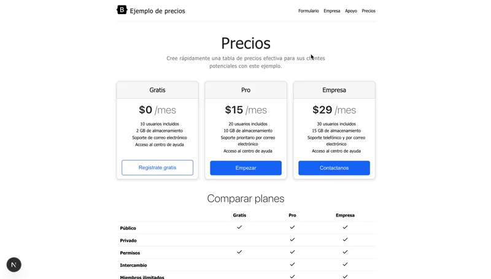
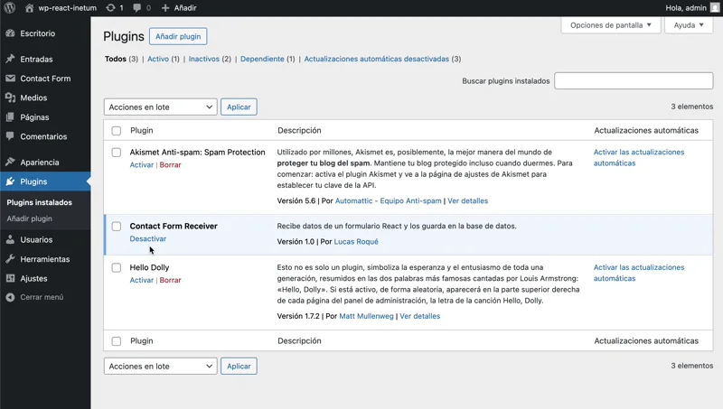

# Formulario React con Validaciones y Gestión en WordPress

Este proyecto es una **aplicación React** creada con **NextJS**, **TypeScript**, **SASS** y **Zod** para la validación de formularios. La aplicación incluye un formulario de contacto con validaciones avanzadas. Adicionalmente se ha hecho un plugin de WordPress que recibe los datos del formulario y gestiona los datos en una tabla de base de datos.

[]()
[]()
[]()
[]()
[]()
[]()



---

## Tecnologías utilizadas

- **Frontend:**
  - NextJS
  - TypeScript
  - SASS
  - Zod (validación de datos)
  - Fetch en server component
- **Backend (WordPress):**
  - Plugin personalizado para gestión de envíos en PHP

---


## Funcionalidades del formulario

El formulario contiene los siguientes campos:

- **Nombre completo:** obligatorio, mínimo 3 caracteres.
- **Email:** obligatorio, debe ser un email válido.
- **Teléfono:** obligatorio, debe ser un número de teléfono móvil válido en España.
- **Mensaje:** obligatorio, máximo 160 caracteres, con un contador en tiempo real que muestra los caracteres restantes.

### Validaciones con Zod

Se implementan las siguientes validaciones:

```typescript
export const FormSchema = z.object({
  name: z
    .string()
    .min(3, "El nombre debe contener al menos 3 caracteres")
    .max(10, "El nombre no debe ser mayor a 20 caracteres"),
  secondname: z
    .string()
    .min(3, "Los apellidos deben contener al menos 3 caracteres"),
  email: z.email("Por favor, introduce un email válido"),
  phone: z
    .string()
    .regex(/^(?!\+34)/, "No hace falta que incluyas el prefijo +34.")
    .regex(
      /^(6|7)\d{8}$/,
      "Introduce un número móvil español válido y sin espacios."
    ),

  message: z
    .string()
    .min(10, "El mensaje debe tener al menos 10 caracteres.")
    .max(160, "El mensaje debe tener maximo 160 caracteres."),
});
```


